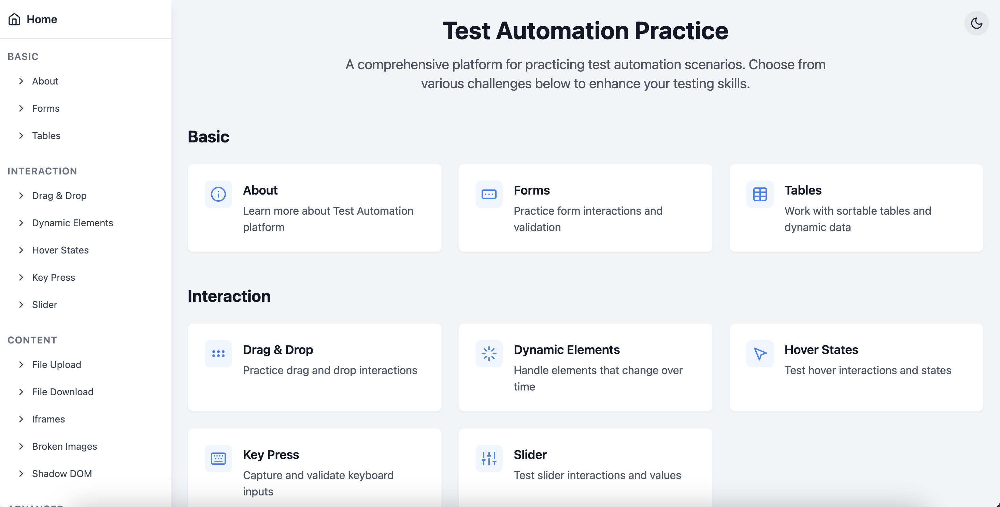

# Test Automation Practice Platform (Web and Mobile Web)

A platform designed to help QA engineers and developers practice test automation with real-world scenarios and challenges for Web and Mobile Web. This application provides various testing opportunities through interactive components and edge cases commonly found in web applications.



## 🚀 Features

- **Form Handling & Validation**

  - Dynamic input validation
  - Error message handling
  - Form submission scenarios

- **Interactive Elements**

  - Drag and drop functionality
  - Dynamic content loading
  - Hover states and animations
  - Context menus
  - Key press events

- **File Operations**

  - File upload with drag & drop
  - File download handling
  - Multiple file formats support

- **Advanced Features**
  - Authentication flows
  - A/B testing scenarios
  - Exit intent detection
  - Shadow DOM manipulation
  - Iframe interactions

## 📦 Installation

1. Clone the repository:

```bash
git clone https://github.com/moatazeldebsy/test-automation-practices.git
cd test-automation-practices
```

2. Install dependencies:

```bash
npm install
```

3. Start the development server:

```bash
npm run dev
```

4. Update deps version:

```bash
npm update
npx npm-check-updates -u
npm install
```

## 🔧 Usage

Here are some examples of how to interact with key features:

### Form Validation

```typescript
// Example test for form validation
test("should show error for invalid email", async () => {
  await page.fill('[data-test="email-input"]', "invalid-email");
  await page.click('[data-test="submit-button"]');
  expect(await page.isVisible('[data-test="email-error"]')).toBeTruthy();
});
```

### Drag and Drop

```typescript
// Example test for drag and drop functionality
test("should reorder items via drag and drop", async () => {
  await page.dragAndDrop(
    '[data-test="drag-handle-1"]',
    '[data-test="drag-handle-2"]',
  );
});
```

## 🤝 Contributing

1. Fork the repository
2. Create your feature branch (`git checkout -b feature/AmazingFeature`)
3. Commit your changes (`git commit -m 'Add some AmazingFeature'`)
4. Push to the branch (`git push origin feature/AmazingFeature`)
5. Open a Pull Request

### Contribution Guidelines

- Write clear, descriptive commit messages
- Update documentation for any new features
- Add tests for new functionality
- Follow the existing code style
- Keep pull requests focused on a single feature

## Product 2476 XML-sensitive tracking fixture

Start the app with `npm run dev`, then open
`/product-2476-xml-values`. The page is a deterministic AUT fixture for
TrueTest tracking and generated Katalon Object Repository `.rs` XML.

- Click **Verify fixtures** or run `window.verifyXml2476Fixtures()` in the
  browser console. Every result should have `matches: true`.
- Recommended tracking order: T01 → T11, then S01 → S05.
- Inspect `action_target[].target_attributes`,
  `action_target[].relative_xpath`, `action_target[].css`, and
  `action_target[].smart` in the captured tracking data.

The AUT provides stable candidate values and structures; the TrueTest tracker
decides which relative XPath, CSS, and smart locators are emitted.

## Console log fixture

Open `/console-logs` to emit deterministic `log`, `debug`, `info`, `warn`, and
`error` browser messages. Use the individual controls to test level filtering,
or **Emit all five levels** to verify ordered Session Replay capture for
[katalon-studio/product#2900](https://github.com/katalon-studio/product/issues/2900).
