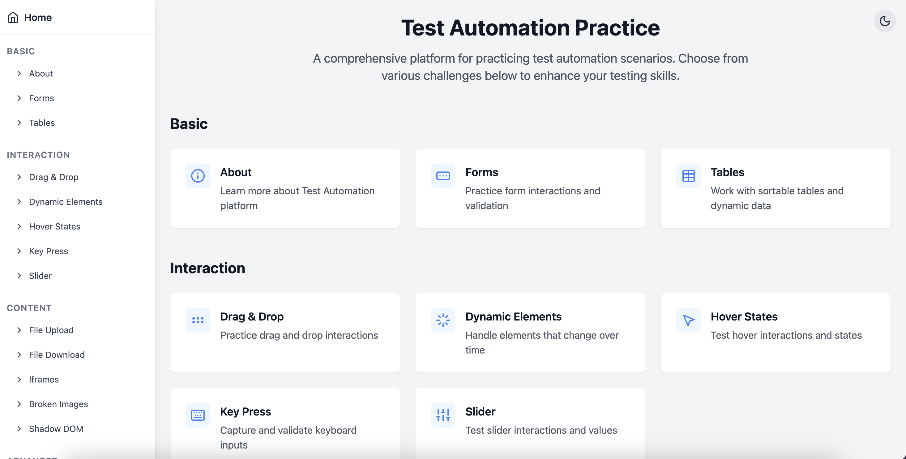

# Test Automation Practice Platform

A comprehensive platform designed to help QA engineers and developers practice test automation with real-world scenarios and challenges. This application provides a wide range of testing opportunities through various interactive components and edge cases commonly found in web applications.



## 🚀 Features

- **Form Handling & Validation**
  - Dynamic input validation
  - Error message handling
  - Form submission scenarios

- **Interactive Elements**
  - Drag and drop functionality
  - Dynamic content loading
  - Hover states and animations
  - Context menus
  - Key press events

- **File Operations**
  - File upload with drag & drop
  - File download handling
  - Multiple file formats support

- **Advanced Features**
  - Authentication flows
  - A/B testing scenarios
  - Exit intent detection
  - Shadow DOM manipulation
  - Iframe interactions


## 📦 Installation

1. Clone the repository:
```bash
git clone https://github.com/moatazeldebsy/test-automation-practice.git
cd test-automation-practice
```

2. Install dependencies:
```bash
npm install
```

3. Start the development server:
```bash
npm run dev
```

## 🔧 Usage

Here are some examples of how to interact with key features:

### Form Validation
```typescript
// Example test for form validation
test('should show error for invalid email', async () => {
  await page.fill('[data-test="email-input"]', 'invalid-email');
  await page.click('[data-test="submit-button"]');
  expect(await page.isVisible('[data-test="email-error"]')).toBeTruthy();
});
```

### Drag and Drop
```typescript
// Example test for drag and drop functionality
test('should reorder items via drag and drop', async () => {
  await page.dragAndDrop(
    '[data-test="drag-handle-1"]',
    '[data-test="drag-handle-2"]'
  );
});
```

## 🤝 Contributing

1. Fork the repository
2. Create your feature branch (`git checkout -b feature/AmazingFeature`)
3. Commit your changes (`git commit -m 'Add some AmazingFeature'`)
4. Push to the branch (`git push origin feature/AmazingFeature`)
5. Open a Pull Request

### Contribution Guidelines

- Write clear, descriptive commit messages
- Update documentation for any new features
- Add tests for new functionality
- Follow the existing code style
- Keep pull requests focused on a single feature


## 👥 Team

- **Moataz Nabil** - Project Owner
  - [LinkedIn](https://www.linkedin.com/in/moataz-nabil/)
